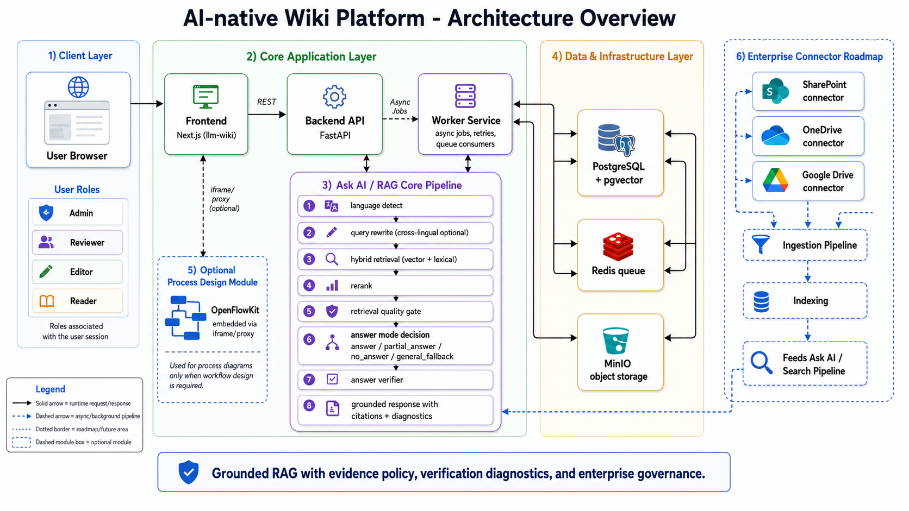
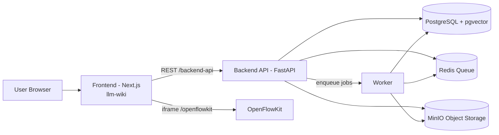
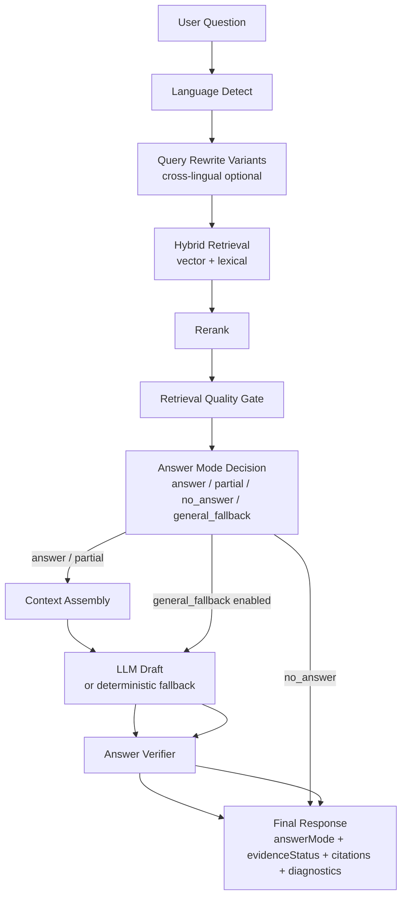
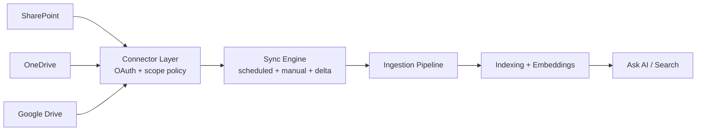
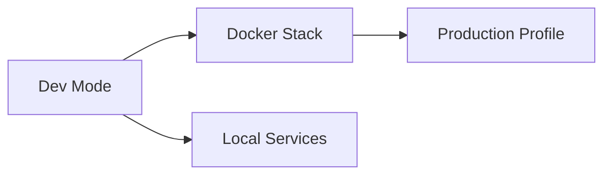

# Project Architecture Overview

## 1) System Architecture

```mermaid
flowchart LR
    U[User Browser]
    FE[Frontend - Next.js<br/>llm-wiki]
    BE[Backend API - FastAPI]
    WK[Worker]
    PG[(PostgreSQL + pgvector)]
    RD[(Redis Queue)]
    MN[(MinIO Object Storage)]
    OFK[OpenFlowKit]

    U --> FE
    FE -->|REST /backend-api| BE
    FE -->|iframe /openflowkit| OFK

    BE --> PG
    BE --> RD
    BE --> MN
    BE -->|enqueue jobs| WK

    WK --> RD
    WK --> PG
    WK --> MN
```

## 2) RAG / Ask AI Flow

```mermaid
flowchart TD
    Q[User Question]
    L[Language Detect]
    RQ[Query Rewrite Variants<br/>cross-lingual optional]
    RET[Hybrid Retrieval<br/>vector + lexical]
    RR[Rerank]
    GATE[Retrieval Quality Gate]
    MODE[Answer Mode Decision<br/>answer / partial / no_answer / general_fallback]
    CTX[Context Assembly]
    LLM[LLM Draft<br/>or deterministic fallback]
    VER[Answer Verifier]
    OUT[Final Response<br/>answerMode + evidenceStatus + citations + diagnostics]

    Q --> L --> RQ --> RET --> RR --> GATE --> MODE
    MODE -->|answer / partial| CTX --> LLM --> VER --> OUT
    MODE -->|no_answer| OUT
    MODE -->|general_fallback enabled| LLM --> VER --> OUT
```

## 3) Enterprise Cloud Sync (Roadmap)

```mermaid
flowchart LR
    SP[SharePoint]
    OD[OneDrive]
    GD[Google Drive]

    CONN[Connector Layer<br/>OAuth + scope policy]
    SYNC[Sync Engine<br/>scheduled + manual + delta]
    ING[Ingestion Pipeline]
    IDX[Indexing + Embeddings]
    ASK[Ask AI / Search]

    SP --> CONN
    OD --> CONN
    GD --> CONN

    CONN --> SYNC --> ING --> IDX --> ASK
```

## 4) Runtime Environments

```mermaid
flowchart LR
    DEV[Dev Mode]
    DKR[Docker Stack]
    LOC[Local Services]
    PROD[Production Profile]

    DEV --> DKR
    DEV --> LOC
    DKR --> PROD
```
